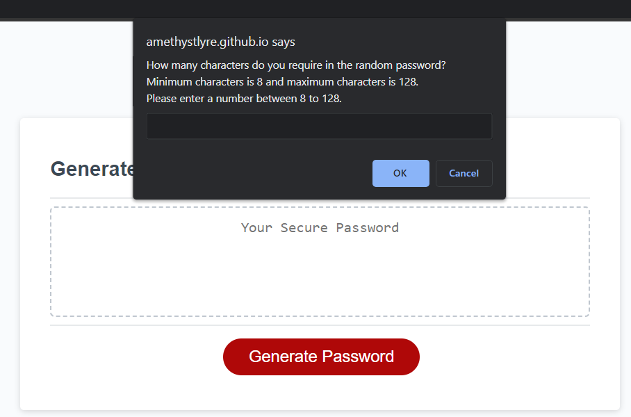
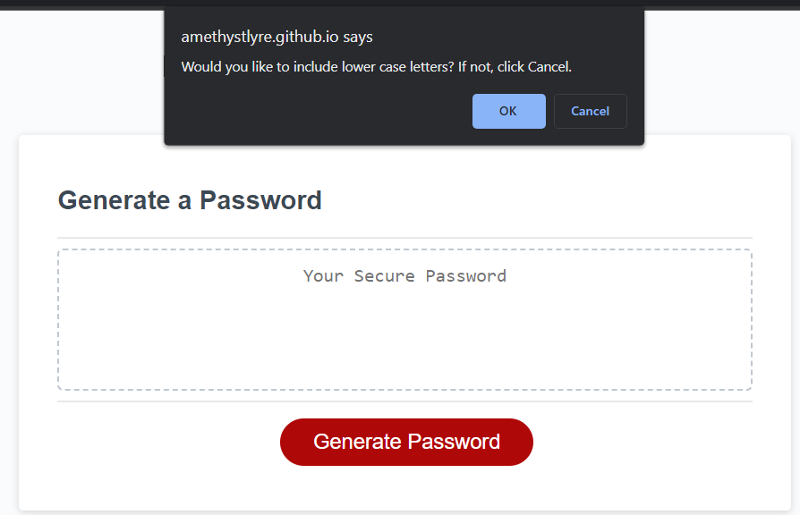
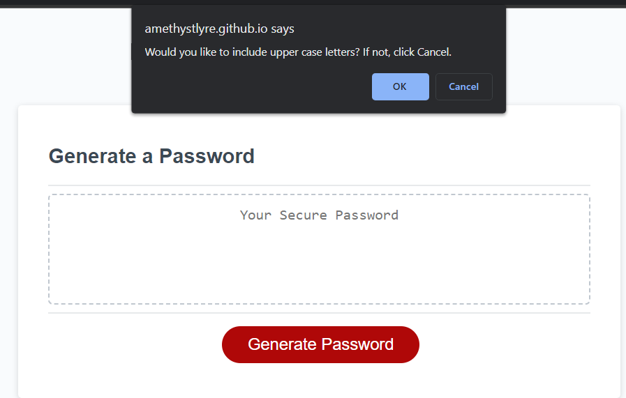
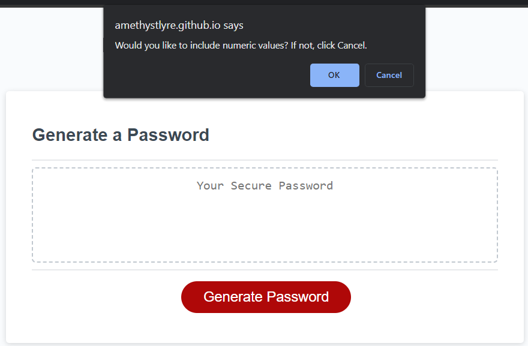
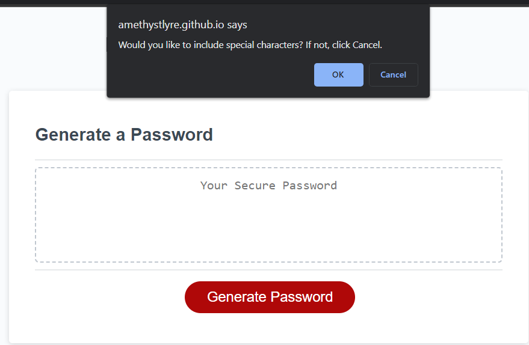
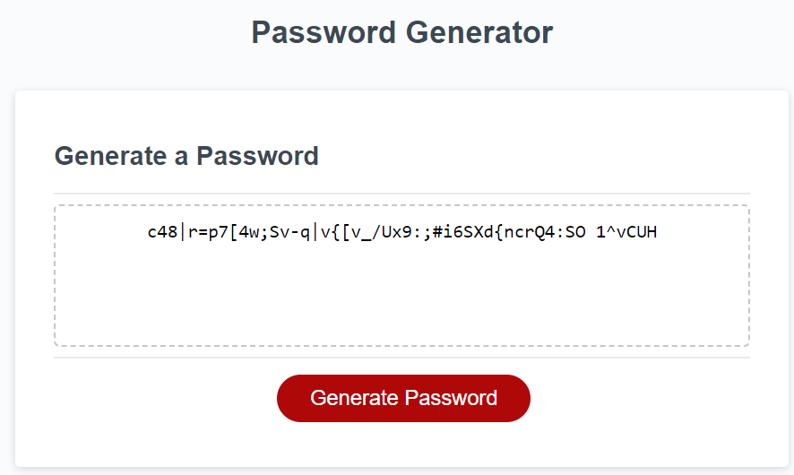

# Password-Generator

A single webpage designed to generate a random password for it's users based on a set of given inputs.

## Description

When user clicks on the Generate Password button, the webpage should ask the user to provide the length of the password characters required.
Then it will ask the user whether the password should include lower case letters, upper case letters, numbers or special characters. After the user responds to the series of questions, the webpage will generate the random password accordingly in the text box.

## Dependencies

* Open in a browser such as Google Chrome, Firefox or Edge etc.

## Installation

* Open url link https://amethystlyre.github.io/Password-Generator/ in above mention browser

## Credits
1. Thanks to Rahul from Tecadmin.net:

    [How to Generate Random String In JavaScript](https://tecadmin.net/generate-random-string-in-javascript/)

## Version History
N/A

## License

This project is licensed under the MIT License - see the LICENSE.md file for details